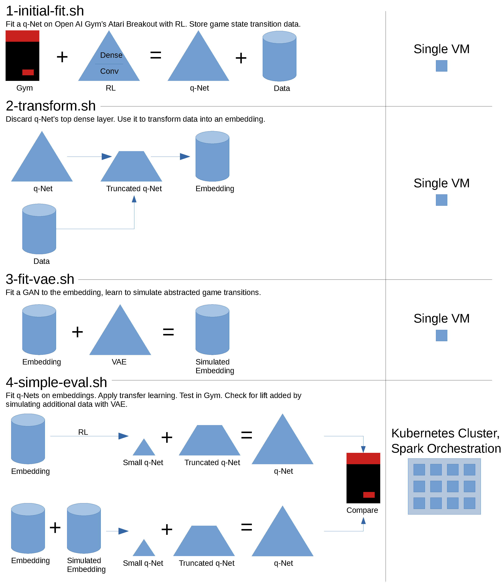

# rl-hypothesis-1
Can we gainfully pad reinforcement learning (RL) datasets with generative adversarial nets (GANs)? If so, RL would be able to leave the realm of video games and drive physical-world automata.

- Essential ideas
  - RL is stuck in simulated worlds until it can avoid entire-game simulation. 
  - GANs can learn to simulate, but suck at exact recreation. I don't hold a grudge, my brain can't do it either.
  - So, we'll fit a q-learning network and chop it in-half to produce an embedding.
  - Fit a GAN to sample from the embedding.
  - Pad the (embedding-level) training dataset with GAN samples then refit the q-learning network (at cut and above). 
    - When samples are few, the statespace should be very sparsely sampled until padded with the GAN. 
    - The q-embedding should be easier to simulate, having only retained game-strategic info and no visual processing info. 
  - When finished, the final q-net is the original but updated post-cut. 

- Testable hypothesis
  - When game samples are constrained, the GAN will provide lift in total game wins. 

## Resources 

Fast and easy experimentation is prioritized. Content will be copied from public repos to avoid manual programming. 
- base q-net software [here](https://github.com/rlcode/reinforcement-learning/blob/master/3-atari/1-breakout/breakout_dqn.py) 
- execution environment [here](https://github.com/jaimeps/docker-rl-gym#docker-hub) 
  - NVidia TOS denies distribution of `cudnn` lib, so environment is CPU-only. This isn't a big setback since game simulation eats most of the time and is largely CPU-driven.
- c-gan [here](https://github.com/eriklindernoren/Keras-GAN/blob/master/cgan/cgan.py) 
  - Given the abstract nature of my data, I'm avoiding simulation of non-continuous values. 
  - Rewards only take on 3 values, so I'm going to condition on it.
  - I'll simulate reward values from their empirical distribution.  

I've tested the q-net and gan software. It's good stuff. The q-net really needs some heavy parallelization, ideally a parameter server. However, I don't have the dev time and will eat the cycles instead. Fortunately, it seems to be using available CPU cores (up to 14) and does seem to need a lot of RAM--so, I'll use a beefy node.  

## Build 

- Build environment: GCP console. 
- Configure with `config.sh` 
  - Service account required.  
- Execute build with `bash build.sh` 

## Execution 

- Fit initial model 
  - Run `bash 1-initial-fit.sh`
- Run transfer learning transform 
  - Run `bash 2-transform.sh`
- Fit GAN 
  - Run `bash 3-fit-gan.sh`
- Simple evaluation 
  - Run `bash 4-scaled-simple-eval.sh`
  - Launches Spark on Kubernetes cluster 
  - Generates samples from GAN
  - Fits a transfer-learned q-net 
  - Returns game play performance statistics

## How it works 

### Engineering details 

- Compute environment is a single, multi-purpose container. 
- VMs and Clusters will auto-terminate after executing work. 
- Spark worker nodes are assigned to preemptible machines, reducing compute costs by about 5 times.

## Results 

This experiment is currently inconclusive. Automation is complete, but I need to find the right parameters for my experiment.  

